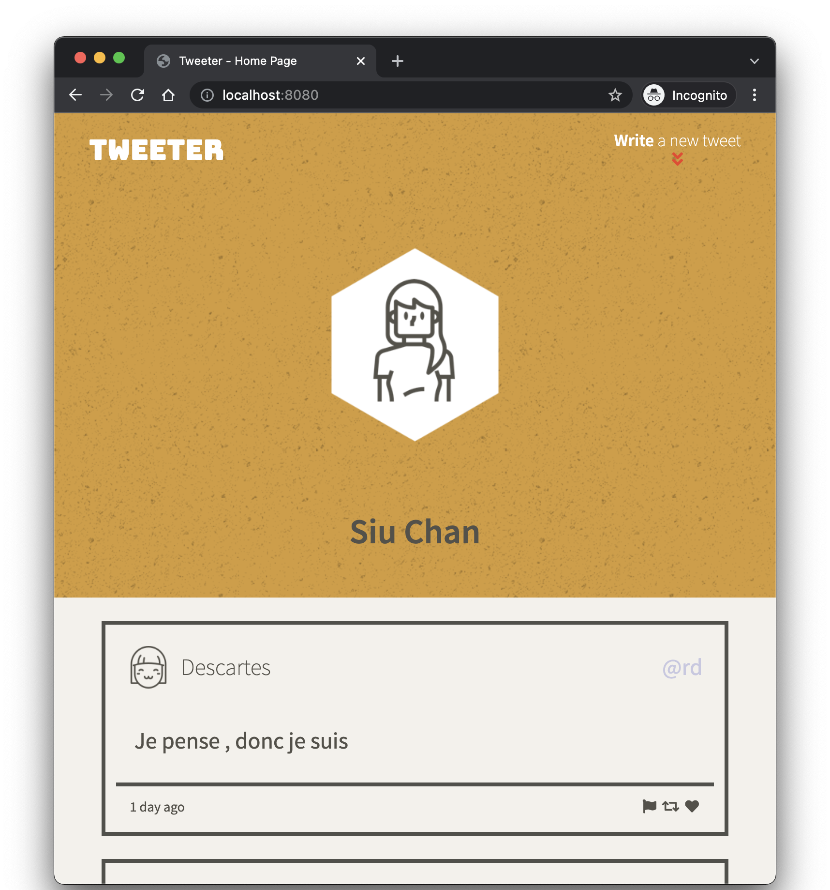

# Tweeter Project

Tweeter is a simple, single-page Twitter clone.

&nbsp; 

## Table of Content
- [Final Product](#final-product)
- [Dependencies](#dependencies)
- [Getting Started](#getting-started)
- [Features](#features)
- [File Structure](#file-structure)

&nbsp; 

## Final Product

View the functionalities (with animated GIF) in [Features](#features) section.

&nbsp; 

## Dependencies

- [Express](https://expressjs.com/)
- [Node.js](https://nodejs.org/en/)
- [body-parser](https://github.com/expressjs/body-parser)
- [chance](https://chancejs.com/)
- [nodemon](https://github.com/remy/nodemon) (for development)
- [sass](https://sass-lang.com/) (for development)

&nbsp; 

## Getting Started

1. Clone this repository onto your local device.
2. Install dependencies using the `npm install` command.
3. Start the web server using the `npm start` command. The app will be served at <http://localhost:8080/>.
4. Go to <http://localhost:8080/> in your browser.
5. (For developtment) another option to start the web server is using the `npm run local` command. [Nodemon](https://github.com/remy/nodemon) will monitors for any changes in the source code and automatically restart the server.
6. (For developtment) the `npm run sass-watch` command enable the sass application to look in the sass directory for any scss files that are created or updated. If there is a change, the corresponding css file in the public/styles directory will be created or updated.

&nbsp; 

## Features

&nbsp; 

&nbsp; 

&nbsp; 

&nbsp; 

&nbsp; 

&nbsp; 

## File Structure

<pre>
📦tweeter
 ┣ 📂.git
 ┣ 📂.github
 ┣ 📂docs
 ┣ 📂public
 ┃ ┣ 📂images
 ┃ ┃ ┗ 📜profile-hex.png
 ┃ ┣ 📂scripts
 ┃ ┃ ┣ 📜buttons.js
 ┃ ┃ ┗ 📜load-tweets-submit-tweet.js
 ┃ ┣ 📂styles
 ┃ ┃ ┣ 📜header.css
 ┃ ┃ ┣ 📜layout.css
 ┃ ┃ ┣ 📜nav.css
 ┃ ┃ ┣ 📜new-tweet-form.css
 ┃ ┃ ┣ 📜scroll-to-top.css
 ┃ ┃ ┗ 📜tweets.css
 ┃ ┣ 📂vendor
 ┃ ┃ ┣ 📜jquery-2.2.3.min.js
 ┃ ┃ ┗ 📜normalize-4.1.1.css
 ┃ ┗ 📜index.html
 ┣ 📂sass
 ┃ ┣ 📜_mixins.scss
 ┃ ┣ 📜_variables.scss
 ┃ ┣ 📜header.scss
 ┃ ┣ 📜layout.scss
 ┃ ┣ 📜nav.scss
 ┃ ┣ 📜new-tweet-form.scss
 ┃ ┣ 📜scroll-to-top.scss
 ┃ ┗ 📜tweets.scss
 ┣ 📂server
 ┣ 📜.gitignore
 ┣ 📜README.md
 ┣ 📜package-lock.json
 ┗ 📜package.json
</pre>

### 📂.git

&nbsp; 

### 📂.github

&nbsp; 

### 📂docs

&nbsp; 

### 📂public
 ┃ ┣ 📂images
 ┃ ┃ ┗ 📜profile-hex.png
 ┃ ┣ 📂scripts
 ┃ ┃ ┣ 📜buttons.js
 ┃ ┃ ┗ 📜load-tweets-submit-tweet.js
 ┃ ┣ 📂styles
 ┃ ┃ ┣ 📜header.css
 ┃ ┃ ┣ 📜layout.css
 ┃ ┃ ┣ 📜nav.css
 ┃ ┃ ┣ 📜new-tweet-form.css
 ┃ ┃ ┣ 📜scroll-to-top.css
 ┃ ┃ ┗ 📜tweets.css
 ┃ ┣ 📂vendor
 ┃ ┃ ┣ 📜jquery-2.2.3.min.js
 ┃ ┃ ┗ 📜normalize-4.1.1.css
 ┃ ┗ 📜index.html

 &nbsp; 

 ### 📂sass
 ┃ ┣ 📜_mixins.scss
 ┃ ┣ 📜_variables.scss
 ┃ ┣ 📜header.scss
 ┃ ┣ 📜layout.scss
 ┃ ┣ 📜nav.scss
 ┃ ┣ 📜new-tweet-form.scss
 ┃ ┣ 📜scroll-to-top.scss
 ┃ ┗ 📜tweets.scss

 &nbsp; 
 
### 📂server
 ┣ 📜.gitignore
 ┣ 📜README.md
 ┣ 📜package-lock.json
 ┗ 📜package.json